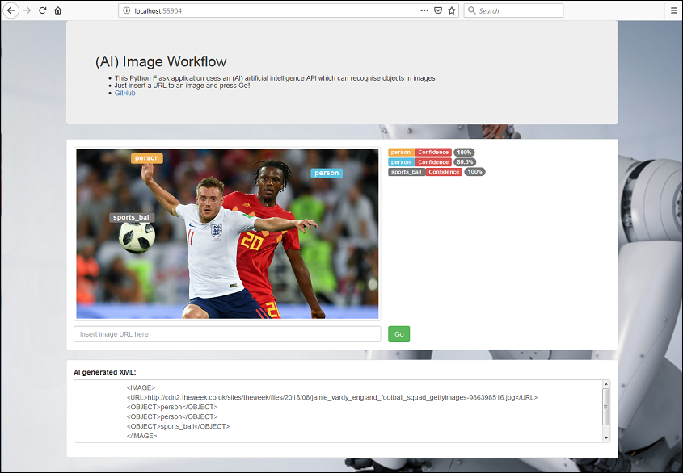

# ai-image-workflow
Artificial intelligence image recognition workflow
[Demo site](http://techjames.pythonanywhere.com/ "(AI) Image Workflow")

<ul>
  <li>This Flask application uses an oject recognition API to categorise images and also create XML
</ul>

